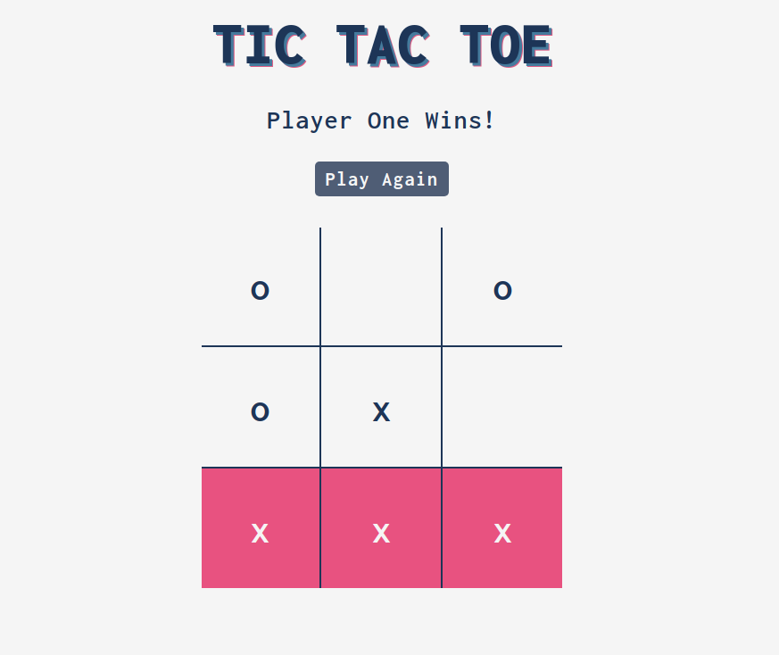

# Tic Tac Toe

A

[Play](https://jmilll.github.io/tic-tac-toe/)

## Example

[Play Here](https://jmilll.github.io/tic-tac-toe/)

## Features

* P

## Motivation

The purpose of this project was to learn and understand object oriented programming using function factories and modules.

## Technologies Used

* JavaScript
* Function Factories
* Modules
* HTML / CSS

## Acknowledgements

This project was inspired by [The Odin Project](https://www.theodinproject.com/courses/javascript/lessons/tic-tac-toe-javascript) online learning curriculum.

## License

MIT